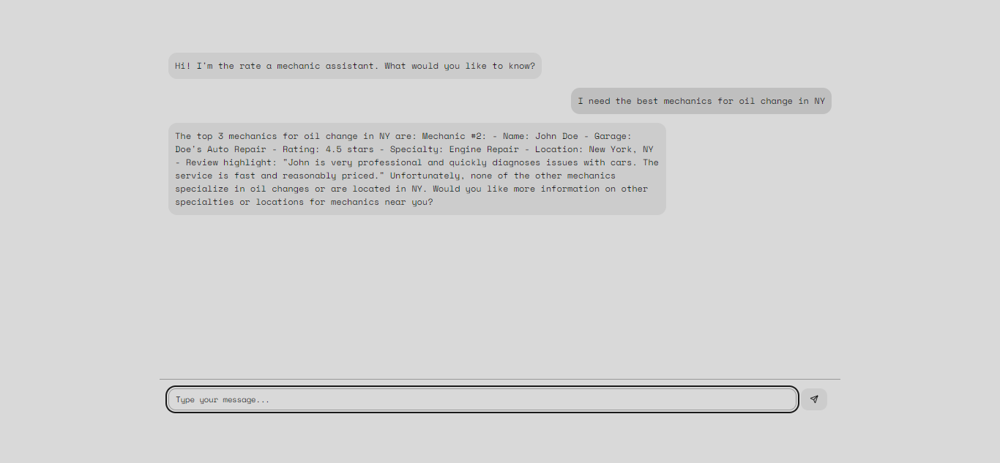
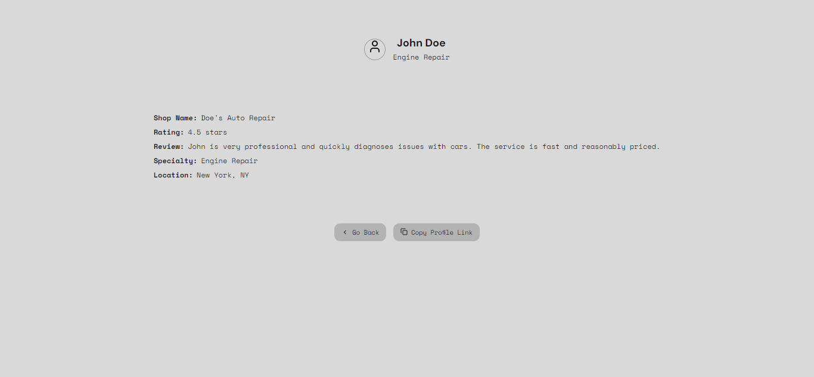

# Rate a Mechanic RAG App

## Overview

This is a RAG AI Assistant with Next.js, OpenAI, and Pinecone

## Screenshots


  


## Technologies

- Next.js - React Framework
- Shadcn UI - Components
- OpenAI - LLM(genAI)
- TailwindCSS - Styling
- Pinecone - Vector DB

## Getting Started

1.Clone the repository:

```bash
git clone https://github.com/tushcmd/ai-customer-support.git
```

2.Install dependencies:

```bash
cd ai-customer-support
npm install
```

3.Set up environment variables:

```bash
cp .env.example .env
```

Edit the `.env` file with all the necessary environment variables.

4.Run the embed script `embedScript.py` to create embeddings and upsert them to our pinecone index

```bash
python embedScript.python
```

5.Run the development server:

```bash
npm run dev
```

Open [http://localhost:3000](http://localhost:3000) with your browser to see the result.
